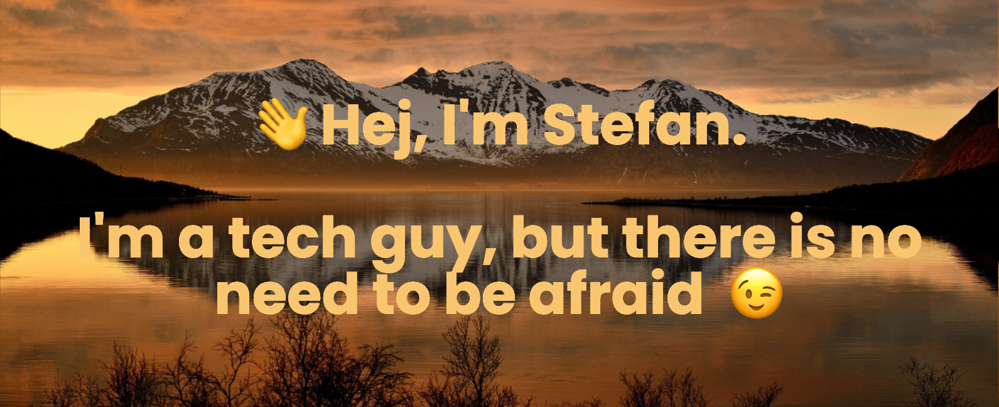

# ❤️ I really like

- 🧑‍💻  Challenges (Big tech projects)
- 💡  Learning (Python, Go, ...)
- 👨‍👩‍👧‍👦  Family (husband and father of two)
- 📚  Reading (Alastair Reynolds, Andy Weir, James S. A. Corey, ...)

# 🔭 I’m currently working on

- 🌎 Kubernetes `Hello World` projects for issues that no other hello world is showing you
- ✨ Automatically detecting Kubernetes deployment configuration issues and auto-generating tickets to fix
- ☁️ Migration of a huge distribution system to AWS

# 📫 How to reach me

If you are interested in my CV, [have a look here](https://stefanjacobs.github.io/cv/). Check out what I've been working on [here](https://github.com/stefanjacobs?tab=repositories) and contact me  [on Twitter](https://twitter.com/stefanj78)! 🚀

## 📈 Stats

<!--  -->
<!--
**stefanjacobs/stefanjacobs** is a ✨ _special_ ✨ repository because its `README.md` (this file) appears on your GitHub profile.

Here are some ideas to get you started:

- 🔭 I’m currently working on ...
- 🌱 I’m currently learning ...
- 👯 I’m looking to collaborate on ...
- 🤔 I’m looking for help with ...
- 💬 Ask me about ...
-
- 😄 Pronouns: ...
- ⚡ Fun fact: ...
-->
